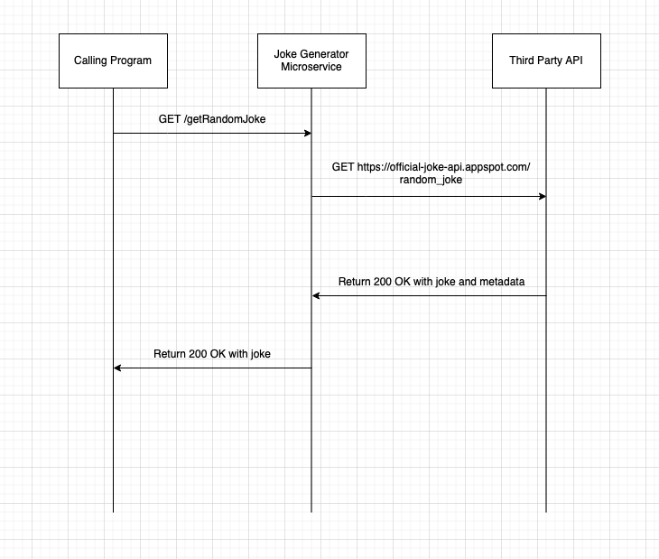

# joke-generator-microservice

I just used my global requests package, other dependencies part of python standard lib.

```
pip3 install requests
python3 ./server.py
```

## Communication Contract

Run the microservice locally - will serve random jokes to calls to the `/getRandomJoke` endpoint via HTTP GET requests. 

Requesting data: navigate to `localhost:8008/getRandomJoke`, or call the `/getRandomJoke` endpoint programmatically with a GET request. Any other HTTP method or endpoint will 404 you!

Example in javascript:

```
const resp = await fetch("http://localhost:8008/getRandomJoke"); // call the microservice programmatically
```

Receiving data: simply wait for the data to come back after calling the `/getRandomJoke` endpoint with a GET request and parse it as json.

The json response has 2 properties: `setup` and `punchline`.

Example in javascript:

```
const resp = await fetch("http://localhost:8008/getRandomJoke"); // call the microservice programmatically
const parsedJson = await resp.json(); // parse the successful response into json
const { setup, punchline } = parsedJson; // extract the setup and punchline of the served random joke
console.log(setup); // prints "What kind of music do planets listen to?" to the console
console.log(punchline); // prints "Nep-tunes." to the console
```

## UML Diagram


